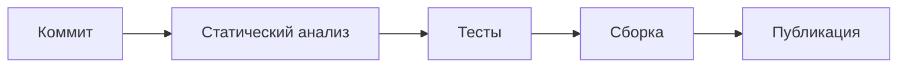

# Стратегия контроля качества

> _"If you have a process that produces defects, then you have a defective process."_

### Глоссарий

| Термин            | Описание                                                                                                                                                                                                                                                              |
| ----------------- | --------------------------------------------------------------------------------------------------------------------------------------------------------------------------------------------------------------------------------------------------------------------- |
| Сервис            | Программа, которую можно развернуть как целостное решение и которая решает четко-определенные задачи одного или нескольких бизнес-доменов. К сервисам относятся также СУБД, брокеры сообщений, хранилища данных и др. софт, выполняющий какие-то действия по запросу. |
| Зависимость       | Внутренний или внешний сервис                                                                                                                                                                                                                                         |
| Внутренний сервис | Программное решение разрабатываемое или поддерживаемое нашей компанией или конкретной ее командой                                                                                                                                                                     |
| Внешний сервис    | Программное решение, находящееся за пределами контура компании или зоны ответственности конкретной команды, функциональность, стабильностьность и производительность которого текущая команда не может контролировать                                                 |

### Основные принципы

* Как команда, мы **разрабатываем продукт** и **решаем проблемы клиентов**
* Контроль качества – зона ответственности **всей команды** и **каждого ее члена**
* Повлиять на качество можно на **любом этапе** разработки продукта
* Чем позже найдена ошибка, чем дороже она нам обходится: самую дорогую цену мы платим за **баги найденные на production**-окружении нашими пользователями, поэтому **стараемся не допускать** таких ситуаций
* Мы тесно взаимодействуем с Поддержкой, Продуктом и другими направлениями, чтобы лучше понимать текущие проблемы, сложности пользователей и сам продукт
* **Ручное тестирование** является неотъемлемой частью QA. Автоматизация требуется далеко не для каждого продукта. Мы понимаем, где и когда можем экономить время за счет автоматизации – в таких ситуациях предпочитаем такой подход **и авто-тесты.**
* Сервисы, которые мы разрабатываем, готовы к развертыванию в локальной, тестовой и других средах с соблюдением приниципов [The Twelve-Factor App](https://12factor.net/ru/)
* **Прагматичные подход** позволяет нам эффективнее двигаться вперед:
  * фокусируемся на критической для бизнеса функциональности и ключевых компонентах
  * убираем внутреннию бюрократию, устаревшие подходы и соглашения

> _I get paid for code that works, not for tests, so my philosophy is to test as little as possible to reach a given level of confidence \[…]. If I don’t typically make a kind of mistake (like setting the wrong variables in a constructor), I don’t test for it._
>
> © Kent Beck

Возможно – это все что нам нужно. Это, и люди, которым не все равно.

### Приоритетность в контроле качества

От наиболее приоритетных к менее приоритетным:

* Явные ошибки в логике ← несоответствие функциональным требованиям
* Неожиданное поведение функциональности, которое может приводить к непониманию со стороны пользователей (UX), ошибкам в данных и др. серьезным последствиям
* Проблемы с производительностью ← несоответствие нефункциональным требованиям
* Неработающий интерфейс – невозможность выполнить необходимые пользователю действия, просмотреть данные, перейти из раздела в раздел
* Несущественные ошибки в UI / UX, которые не влияют на функциональность изменений

### Точка старта

После того, как `стори` или `задача` передана в производство, т.е. отправлена на доску в To Do, QA-инженеры совместно с командой предоставляют раннюю обратную связь заказчику, задают вопросы или подсвечивают моменты, которые не были указаны в требованиях и описании.

На этапе установочных встреч по задаче внутри команды QA помогают определить:

* будут ли изменения, предполагаемые в задаче, завтрагиваться при разработке в будущем
* сколько ресурсов хочется инвестировать в тестирование
* применяемые типы тестирования – ручное и/или авто
* кто внутри кросс-функциональной команды что и как тестирует, на каком этапе
* есть ли критическая функциональность для которой необходимы E2E-тесты сейчас или позже
* необходим ли по итогу регресс

### Жизненный цикл изменений сервиса

### Статический анализ кода

Несогласованность в стиле кода, ошибки, связанные с типизацией или утвержденными в команде правилами, deprecated warnings, отлавливаются автоматически на этапе статического анализа кода и линтинга за счет внедрения соответствующих инструментов: [.NET source code analysis](https://learn.microsoft.com/en-us/dotnet/fundamentals/code-analysis/overview?tabs=net-9), ESLint, etc. Исправление warnings является зоной ответственности разработчиков.

Если на этапе статического анализа появляется предупреждение (warning), пайплайн падает ❌ и прогон тестов не выполняется. Разработчики обязаны исправить предупреждение.

### Авто-тесты

Авто-тесты – это тоже код, который нужно поддерживать. Как и любой код, он может накапливать технический долг. 100% покрытие авто-тестами – это не показатель, к которому мы стремимся. Для нас важны другие метрики качества и разработки: количество ошибок, проскальзывающих на этапах разработки, повторяющиеся баги, скорость доставки изменений.

Тесты, которые мы пишем, должны быть не сложнее тестируемой логики и **отражать намерения пользователя** (“кликнуть третий тег \<button> на странице” vs “кликнуть кнопку Сохранить” на странице операции”).

Исходя из ограниченности ресурсов в командах и следуя правилу 80/20 (принцип Парето), основной упор мы делаем на разработку интеграционных тестов и ручное тестирование, оставляя E2E-тесты для проверки комплексных пользовательских сценариев.

### Интеграционные тесты (must)

| Зона ответственности                    | Разработчики сервиса                                                           |
| --------------------------------------- | ------------------------------------------------------------------------------ |
| Запускаются                             | Локально, на CI                                                                |
| Окружение                               | 
Самодостаточное

Состояние сбрасывается при каждом выполнении
      |
| Примеры тестируемой логики на бэкенде   | 
Методы API

Бизнес-логика, валидация данных

Обработка данных
 |
| Примеры тестируемой логики на фронтенде | 
Стейт-менеджмент

Бизнес-логика, валидация данных
                  |
| _Используемые технологии_               |                                                                                |
| Подходы и соглашения                    | Интеграционные тесты                                                           |

#### Тестирование зависимостей

Внешние зависимости для команды – черный ящик с некоторым контрактом типа HTTP API и не всегда стабильным и предсказуемым поведением. Пример – Сбер Бизнес или сервис, которым команда не владеет (для веб-сайта – это Core API).

При написании интеграционных тестов в выборе моки\[^1] vs _запрос в_ _сторонний_ сервис, предпочтение отдается последнему. Существует два варианта использования внешнего сервиса в тестах:

* [service stub](https://martinfowler.com/eaaCatalog/serviceStub.html) – определяется интерфейс сервиса → пишется имплементация, которая отправляет запросы во внешний (реальный) сервис → пишется дополнительная имплементация, которая хранит данные в памяти и не выполняет реальных запросов → при запуске тестов в тест-кейсы передается фейковая имплементация. Для того, чтобы фейковая имплементация не разошлась с реальной, реализуются проверки, которые выполняются в стороне от основного набора тестов.\[^2]
* **fake service** – сервис, который разрабатывается командой, мимикрирует под реальный, но взаимодействие с которым происходит через протокол, аналогичный реальному сервису, например, HTTP API. Этот вариант предпочтительнее, когда в зоне ответственности команды находится несколько разрабатываемых сервисов, каждый из которых взаимодействует с внешним. Пример такого внешнего сервиса – сервис рассылок или уведомлений. Другой причиной необходимости реализации фейкового сервиса является желание протестировать отказоустойчивость разрабатываемого сервиса (отказ по сети, непредвиденные ответы и пр.)

Какой вариант использовать – решает команда исходя из задачи и целей тестирования.

### Юнит-тесты (yes, but…)

| Зона ответственности       | Разработчики сервиса                                                                                       |
| -------------------------- | ---------------------------------------------------------------------------------------------------------- |
| Запускаются                | Локальное, CI                                                                                              |
| Окружение                  | 
Самодостаточное

Состояние сбрасывается при каждом выполнении
                                  |
| Примеры тестируемой логики | “Чистые” функции, статические классы и методы, логика без внешних зависимостей: данные → метод → результат |
| _Используемые технологии_  |                                                                                                            |
| Подходы и соглашения       | Юнит-тесты                                                                                                 |

Следуя принципу 80/20, мы хотим достичь максимально возможного качества путем инвестирования своего времени в один-два типа тестирования. С точки зрения автоматизации – это интеграционные тесты.

На данном этапе (январь 2025) у команд нет возможности запускать все необходимые компоненты тестируемого сервиса на CI, поэтому юнит-тесты могут служить промежуточным этапом внедрения авто-тестов.

Пример: есть метод API, который отдает некоторый сериализованный в JSON объект с полем (свойством) содержащим форматированную в нужном клиенту (веб-приложение) формате дату; в какой-то момент метод начинает отдавать дату в неправильном формате. Т.к. написать интеграционный тест, вызывающий метод API и проверяющий возвращаемые данные, не представляется возможным, пишется юнит-тест на метод форматирования даты. В результате, проблемный сценарий закрыт авто-тестом.

### Ручное тестирование (must)

| Зона ответственности              | QA-инженеры                                                                                                                                                                               |
| --------------------------------- | ----------------------------------------------------------------------------------------------------------------------------------------------------------------------------------------- |
| Окружение для проверки            | тестовое (testing) – состояние или его часть может сохранятся для будущих проверок                                                                                                        |
| Примеры тестируемых **сценариев** | См. примеры в таблице E2E-тестов                                                                                                                                                          |
| Используемые технологии           | 
Системное мышление, пыткий ум, шустрые руки

Система учета тест-кейсов (Allure / <a href="https://testit.software">Test IT</a>), <a href="https://www.usebruno.com">Bruno</a>
 |
| Подходы и соглашения              | Ручное тестирование                                                                                                                                                                       |

Основной фокус – **пользовательские сценарии** ‼️

Что не является пользовательскими сценариями:

* **Логика API-методов** – проверка правильности обработки запроса и возврата ожидаемого ответа
* **Версионность и совместимость API** – проверка работоспособности версий API после изменений
* **Валидация данных и ограничения** – правила валидации без привязки к пользовательскому поведению
* **Аутентификация и авторизация** – проверка токенов, типа авторизации
* **Фоновые задачи и асинхронные процессы** – валидация работы cron-задач, очередей сообщений и т.п.
* **Производительность и нагрузочное тестирование** – измерение времени отклика API, масштабируемости и поведения системы под нагрузкой
* **Кэширование** – проверка сроков жизни кэша, его инвалидирования и согласованности с базой данных
* **Безопасность** – защита от SQL-инъекций, XSS, CSRF и других атак
* **Фиче-флаги и A/B-тестирование** – корректность работы переключаемых функций в разных конфигурациях

### E2E-тесты (yes, but…)

| Зона ответственности              | QA-инженеры                                                                                                                                                                                                                                                                                                                                                                                                     |
| --------------------------------- | --------------------------------------------------------------------------------------------------------------------------------------------------------------------------------------------------------------------------------------------------------------------------------------------------------------------------------------------------------------------------------------------------------------- |
| Запускаются                       | Локально, CI – _отдельно от тестов для кода сервисов_                                                                                                                                                                                                                                                                                                                                                           |
| Окружение для проверки            | 
staging (RC), production

Состояние может сохранятся для будущих проверок
                                                                                                                                                                                                                                                                                                                           |
| Примеры тестируемых **сценариев** | <ul><li>Неавторизованный пользователь перешел на страницу ЛК → произошел редирект на страницу ввода логина/пароля → пользователь ввел логин и пароль → попадает на страницу ЛК</li><li>Авторизованный пользователь переходит на страницу настройки интеграции → нажимает кнопку Подключить для Т-Банка → … → интеграция подключена → пользователь видит всплывающее сообщение об успешном подключении</li></ul> |
| Используемые технологии           | [Python](https://www.python.org), [pytest](https://docs.pytest.org/en/stable/), [Playwright](https://playwright.dev/python/)                                                                                                                                                                                                                                                                                    |
| Подходы и соглашения              | E2E-тесты                                                                                                                                                                                                                                                                                                                                                                                                       |

Самые дорогие и медленные тесты с точки зрения выполнения тесты.\[^3]

На этапе анализа задачи пытаемся предсказать возврат инвестиций в написание таких тестов.

Пишем E2E-тесты, в том числе для уже реализованной функциональности.

### Визуальное тестирование (nice-to-have)

| Зона ответственности    | Frontend– и QA-инженеры                                                                                                                                             |
| ----------------------- | ------------------------------------------------------------------------------------------------------------------------------------------------------------------- |
| Запускаются             | Локально, CI                                                                                                                                                        |
| Окружение для проверки  | 
staging (RC), production

Состояние может сохранятся для будущих проверок
                                                                               |
| Назначение              | Тесты разрабатываются для списка URL-страниц приложения. Сначала выполняются на production-окружении, затем на (тестовом) окружении, где находятся новые изменения. |
| QA                      | Сгенерированный отчет просматривается QA на предмет расхождений, если необходимо, заводятся баги.                                                                   |
| Используемые технологии | [BackstopJS](https://garris.github.io/BackstopJS/)                                                                                                                  |

### Регресс

Регрессионное тестирование выполняется при:

* рефакторинге критической функциональности и ключевых компонент системы
* релизе изменений, которые затрагивают существующую функциональность
* планово раз в 3 месяца

Регресс представляет собой план тестирования – понятный список пользовательских высокоуровневых сценариев (не более 100 элементов) для конкретного продукта и его разделов. Для каждого продукта, например, веб– или мобильного приложения, публичного API составляется свой список.

Примеры группировки сценариев:

* Аутентификация
* Настройки профиля
* Настройки интеграции
* Email-уведомления

### Несколько слов о доступности (Accessibility)

На данный момент ни один из продуктов X не учитывает потребности людей с ограниченными возможностями. Поддержка screen reader-а – важная история. Совместно с дизайнерами и руководителями продуктов, мы могли бы начать двигаться в направлении улучшения UX.

Для тестирования пригодятся следующие инструменты:

* [ax](https://www.deque.com/axe/browser-extensions/) – разрешение для браузера
* [Accessibility Insights for Web](https://accessibilityinsights.io/docs/web/overview/) для валидации семантики кода
* [Headings Map](https://addons.mozilla.org/en-US/firefox/addon/headingsmap/)

***

\[^1]: Почему не моки: код засоряется boilerplate-кодом моков, поведение объектов подменяется в рантайме при перехвате запросов к реальной имплементации, проверки выглядят повторяющими себя.

\[^2]: [Use stubs to isolate parts of your application from each other for unit testing](https://learn.microsoft.com/en-us/visualstudio/test/using-stubs-to-isolate-parts-of-your-application-from-each-other-for-unit-testing?view=vs-2022\&tabs=csharp)

\[^3]: E2E-тесты
