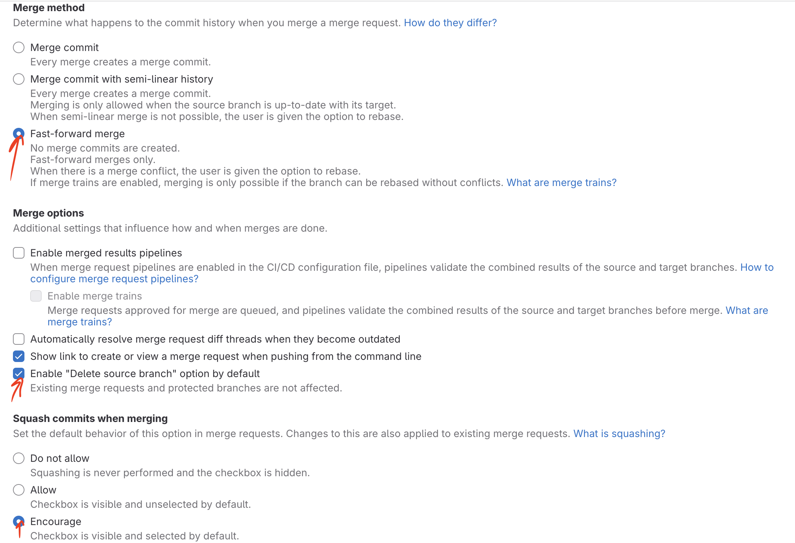

# Работа с ветками в git

### Настройки репозитория

Указанные ниже настройки необходимы для линейной истории в мастере:

<figure><figcaption></figcaption></figure>

### Мастер

* Мастер-ветка репозитория всегда готова к релизу и разворачиванию на staging, RC и продакшене
* В мастер-ветку сливаются только ветки прошедшие ревью кода и тестирование
* Пушить коммиты в обход MR допускается только в исключительных случаях

### Релизы

См. Релизы сервисов

### Формат имен веток

Каждая ветка имеет префикс в виде типа задачи:

* **feat** – новая функциональность
* **fix** – правки, включая баг-фикс
* **chore** – рефакторинг и другие улучшения напрямую не связанные с продуктом

После префикса идут опциональный номер задачи в Трекере и короткое осмысленное название.

Примеры:

```
feat/PF2-xxxx-sberbank-integration
feat/PF2-xxxx-transactions-api
 
chore/PF2-xxxx-upgrade-sqlclient
chore/PF2-xxxx-remove-obsolete-integrations
chore/PF2-xxxx-refactor-admin-api
 
fix/PF2-xxxx-broken-sberbank-integration
fix/PF2-xxxx-transactions-processing
fix/PF2-xxxx-missing-application-config
```

### Код-ревью и слияние с мастером

После успешного ревью ветка должна быть протестирована QA. Для этого автору необходимо выставить соответствующий статус в Трекере и проставить лейбл в GitLab.

<figure><figcaption></figcaption></figure>

QA разворачивает ветку на тестовом окружении и проверяет изменения. Исключения:

* MR не требующий ревью и тестирования
* разработчик и QA договорились, что есть смысл тестировать только интеграционную ветку

Ветка не вливается в мастер или интеграционную ветку пока тестировщики не переведут ее в статус `✅ Тестирование`.

**Важно:** для избежания конфликтов необходимо периодически делать **rebase** на мастер или интеграционную ветку.

**Для слияния с мастером:**

```
git rebase origin/master
```

**Для слияния с интеграционной веткой рассрочки:**

```
git rebase origin/integration/installment-payments
```

По умолчанию коммиты в ветке перед слиянием [сквошатся](https://www.git-tower.com/learn/git/faq/git-squash). Разработчик может отказаться от сквоша коммитов если требуется сохранить в истории репозитория важные этапы работы над изменениями.

### Интеграционная ветка

Интеграционная ветка необходима в двух перечисленных ниже случаях.

1\. Упрощение ревью кода путем разбиения большого количества изменений небольшие итерации – слияние (и выкатка) таких изменений с мастером не повлияет на текущую функциональность.

Примеры:

* Рефаторинг, который затрагивает десятки файлов
* Сложная логика, которую проще дорабатывать последовательными шагами

2\. Большая продуктовая задача с декомпозицией на подзадачи.

Примеры:

* Рассрочка
* Авторизация по контрагентам
* Импорт данных из нового источника
* Перевод API на новую версию

Интеграционная ветка и MR для нее в статусе Draft  создаются заранее – до начала работы над крупной функциональностью. Формат имени: `integration/<title>`.

Работа над каждым из этапов задачи ведется в отдельной ветке. Над отдельными ветками могут работать разные разработчики.

Промежуточная ветка сливается с интеграционной по готовности.

> В рамках интеграционной ветки периодически выполняется git rebase с мастером во избежание конфликтов.

```
git rebase origin/master
```

> Процесс тестирования интеграционной ветки отличается только типом тестирования. QA проводит **интеграционное тестирование** изменений полагаясь на то, что каждая из итераций была уже успешно протестирована в отдельных ветках, слитых с интеграционной.

> Сквошить коммиты интеграционной ветки не требуется.

### Завершение работы с веткой

Для того чтобы рабочая ветка после слияния с мастером или интеграционной веткой была удалена на сервере Git, необходимо поставить галочку Delete source branch в MR.
